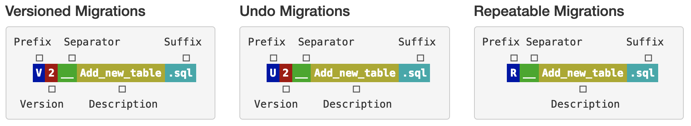

# AWS Lambda Database Schema Migration

The database migrator is a java serverless application that can be used to make changes to the a database 
schema. SQL-based migrations are typically used for:

1. DDL changes (CREATE/ALTER/DROP statements for TABLES,VIEWS,TRIGGERS,SEQUENCES,…)
2. Simple reference data changes (CRUD in reference data tables)
3. Simple bulk data changes (CRUD in regular data tables)

It is an implementation of Boxfuse's Flyway migration tool for the serverless framework. As a result a flyway table is 
created in the database to track the migrations.

## Adding a new migration
In order to add a new migration schema a new sql migration need to be provided in the folder 
src/main/resources/db/migration and follow the flyway naming standard seen below. 

The file name consists of the following parts:

* Prefix: V for versioned, U for undo  and R for repeatable migrations 
* Version: Version with dots or underscores separate as many parts as you like (Not for repeatable migrations)
* Separator: __ (two underscores) 
* Description: Underscores or spaces separate the words
* Suffix: .sql 

The Flyway documentation link below describes the mechanism behind the 3 types of migration script described in the 
image above: 
[Flyway documentation](https://flywaydb.org/documentation/migrations)

## Deploying the function

## Running the migration
